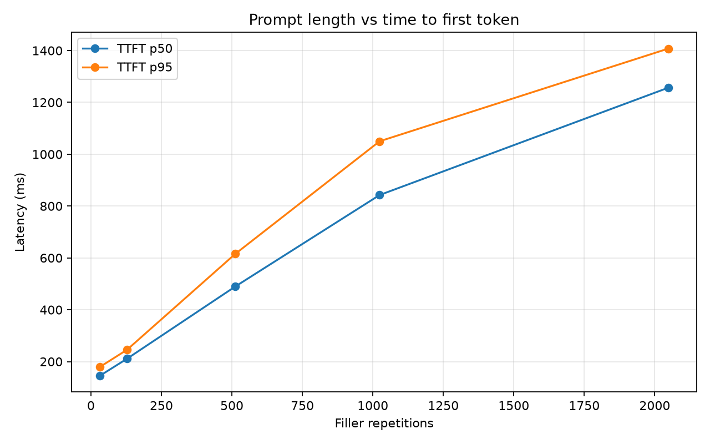
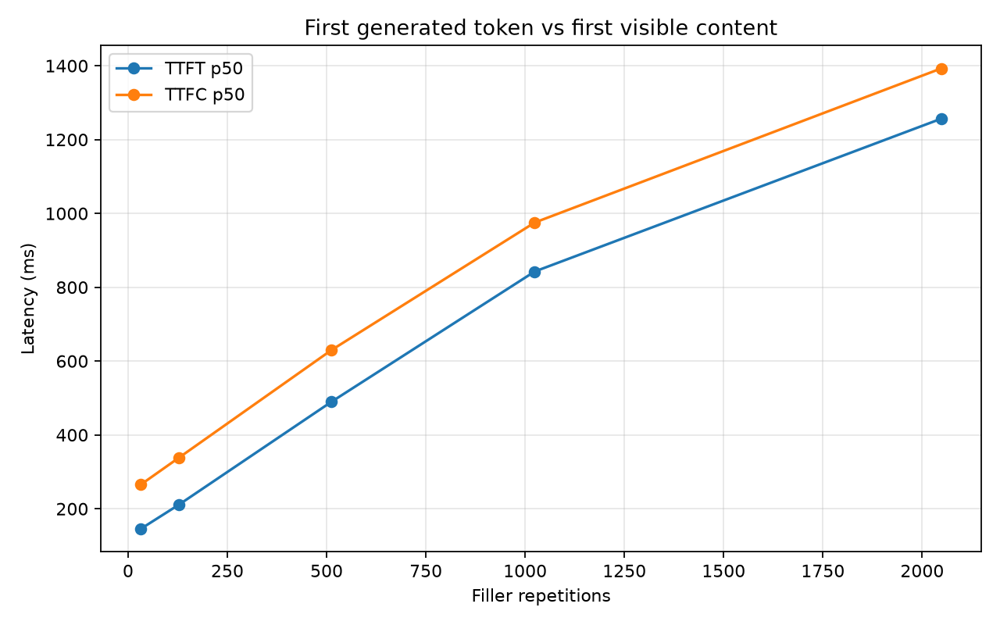

# Day 3 — Prompt length and prefill latency

## Question

How does increasing input length affect time to first token (TTFT) for one user?

## Hypothesis

Longer prompts will increase TTFT because the model must process more input and
populate a larger KV cache during prefill before it can generate the first token.

## Setup

- GPU: RTX 5060 Ti 16 GB
- Model: `google/gemma-4-12b-qat`
- Server: LM Studio's OpenAI-compatible API
- Load: one sequential request at a time
- Samples: 20 requests at each input size
- Input: a unique request prefix followed by 32, 128, 512, 1,024, or 2,048
  repetitions of `blue`
- Generation: temperature 0, maximum 256 completion tokens, and a fixed request
  to reply with `OK`

The unique prefix changes near the start of every request to prevent identical
prompts from benefiting from prefix-cache reuse.

## Metrics

- **TTFT:** request start to the first generated chunk, including reasoning.
- **TTFC:** request start to the first user-visible content chunk.
- **E2E:** request start to completion of the stream.

## Results

| Filler repetitions | TTFT p50 | TTFT p95 | TTFC p50 | TTFC p95 | E2E p50 | E2E p95 |
| ---: | ---: | ---: | ---: | ---: | ---: | ---: |
| 32 | 0.146 s | 0.180 s | 0.265 s | 0.299 s | 0.286 s | 0.320 s |
| 128 | 0.211 s | 0.246 s | 0.338 s | 0.372 s | 0.359 s | 0.393 s |
| 512 | 0.490 s | 0.615 s | 0.630 s | 0.745 s | 0.652 s | 0.767 s |
| 1,024 | 0.843 s | 1.050 s | 0.975 s | 1.182 s | 0.997 s | 1.204 s |
| 2,048 | 1.257 s | 1.407 s | 1.393 s | 1.543 s | 1.415 s | 1.566 s |





## Conclusion

Median TTFT increased from 146 ms at 32 filler repetitions to 1.257 seconds at
2,048 repetitions, an increase of about 8.6×. The median delay from the first
generated token to visible content stayed comparatively stable at roughly
119–140 ms, so prompt prefill—not the short fixed completion—drove most of the
latency growth.

## Limitations

- Filler repetitions are not exact tokenizer-token counts, so the x-axis does
  not yet support a per-token prefill-rate calculation.
- Measurements are client-observed and include local HTTP and parsing overhead.
- The experiment measures sequential, warm single-user behavior and does not
  describe concurrent serving performance.

## Run

From the repository root with the virtual environment activated:

```bash
python3 003-prompt-length-sweep/benchmark_prompt_length.py
```
