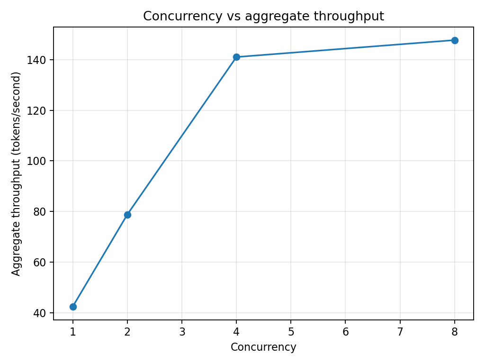
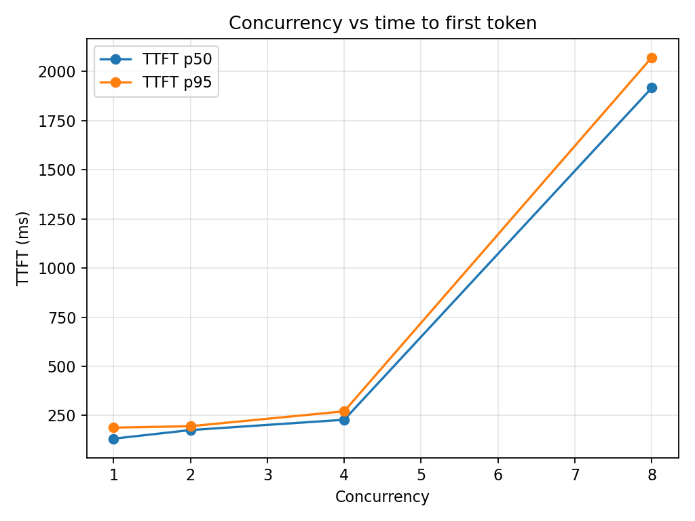
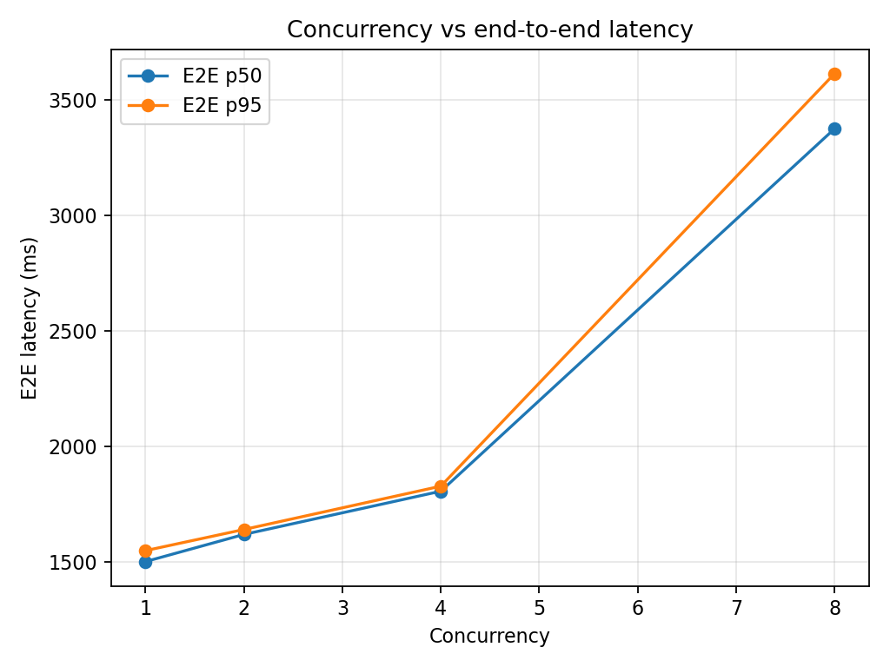

# Day 5 — Concurrency and saturation

## Question

How does concurrency affect per-request latency and aggregate throughput?

## Setup

- Model: `google/gemma-4-12b-qat` in LM Studio
- Workload: 20 requests per level, 31 prompt tokens and 64 completion tokens each
- Concurrency: 1, 2, 4, and 8; one discarded warm-up request
- Metrics: client-observed TTFT, E2E latency, and aggregate completion tokens/second

## Results

| Concurrency | TTFT p50 | TTFT p95 | E2E p50 | E2E p95 | Aggregate tok/s |
| ---: | ---: | ---: | ---: | ---: | ---: |
| 1 | 0.132 s | 0.188 s | 1.503 s | 1.550 s | 42.50 |
| 2 | 0.176 s | 0.196 s | 1.620 s | 1.642 s | 78.84 |
| 4 | 0.228 s | 0.271 s | 1.807 s | 1.829 s | 141.02 |
| 8 | 1.917 s | 2.072 s | 3.376 s | 3.614 s | 147.70 |

## Conclusion

Throughput scaled well through concurrency four, then improved only 4.7% from
141.02 to 147.70 tok/s at concurrency eight. Over the same step, median TTFT
rose 8.4× and median E2E rose 1.9×. The two latency cohorts at concurrency eight
indicate a four-sequence service capacity: excess requests wait roughly one
generation interval for an available slot.

This closed-loop client benchmark identifies the saturation point but does not
separate server queue time from prefill or decode time; server-side tracing is a
future extension.
