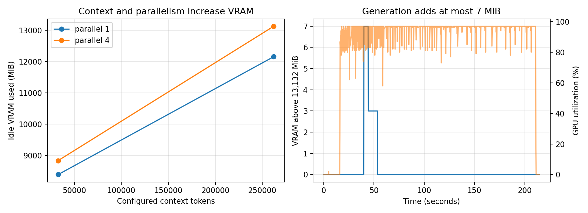

# Day 6 — VRAM and KV-cache capacity

## Question

How do configured context length and parallel request capacity affect VRAM, and
does memory grow while the model generates tokens?

## Setup

- GPU: NVIDIA GeForce RTX 5060 Ti, 16,311 MiB
- Model: `google/gemma-4-12b-qat` (LM Studio reports 7.15 GB)
- Context lengths: 32,768 and 262,144 tokens
- Parallel capacities: 1 and 4
- Unloaded GPU baseline: 87 MiB
- Activity trace: `nvidia-smi` sampled every 0.2 seconds during the Day 4 output sweep
- LM Studio auto-optimization disabled; context and parallel capacity set in its UI

## Results

| Context | Parallel 1 | Parallel 4 | Cost of three extra slots |
| ---: | ---: | ---: | ---: |
| 32,768 | 8,385 MiB | 8,832 MiB | 447 MiB |
| 262,144 | 12,158 MiB | 13,132 MiB | 974 MiB |

Increasing context from 32,768 to 262,144 tokens cost 3,773 MiB at parallel 1
and 4,300 MiB at parallel 4. That is an empirical total-VRAM slope of about
16.8 and 19.2 KiB per additional configured token, respectively; it includes
all context-dependent buffers and is not a measurement of pure KV bytes.

The generation trace contains 1,019 samples. VRAM stayed between 13,132 and
13,139 MiB, a range of only 7 MiB, while active samples averaged 94.7% GPU
utilization and peaked at 97%. Active power averaged 138.2 W and peaked at
142.88 W.

## Conclusion

LM Studio allocated almost all observed serving memory when the model was
loaded; generation reused that allocation instead of growing VRAM in proportion
to generated tokens. Model weights and runtime state dominate the fixed cost,
but longer configured context consumes several GiB and makes each additional
parallel slot more expensive. This explains the Day 5 result: with parallel
capacity four, concurrency eight queued requests rather than increasing useful
throughput substantially.

These figures are empirical allocations for this model and LM Studio build.
They do not isolate the KV cache from weights, compute buffers, or allocator
overhead, and WSL `nvidia-smi` does not list the owning Windows process.
